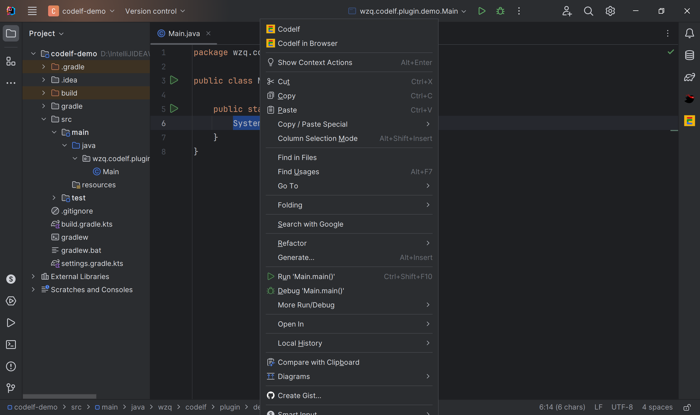
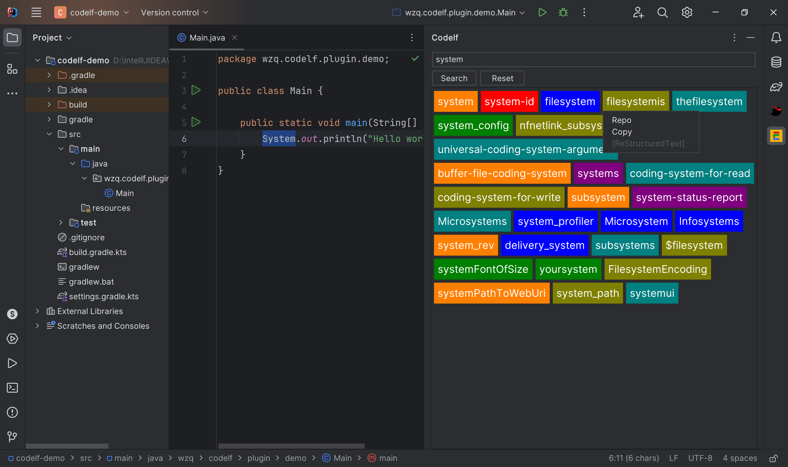
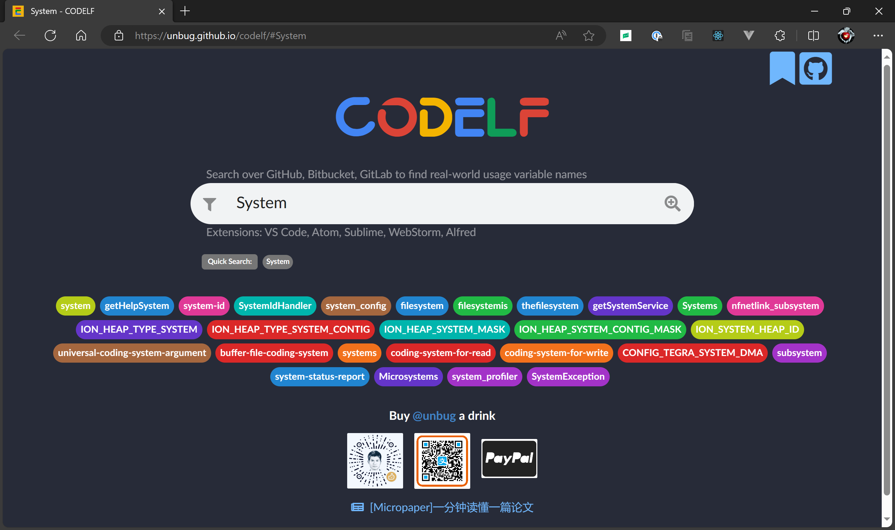

    

    

## Usage

## Language

## CI/CD

## Related projects

- [codelf](https://github.com/unbug/codelf)
- [searchcode](https://searchcode.com/)

## Semver

Plugin is following [Semantic Versioning 2.0.0](https://semver.org/)

## License

[MIT](./LICENSE)
